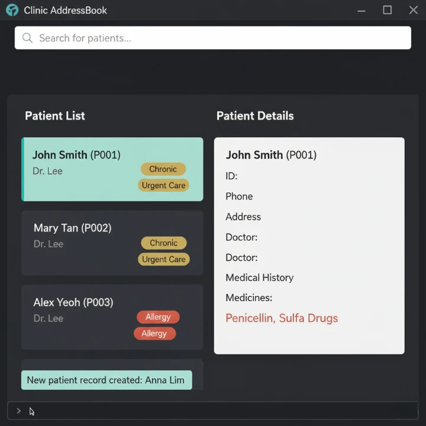

# CLInic - Clinic Management System

CLInic is a desktop application designed for clinic managers to efficiently manage patient records, track medicine distribution, and maintain clinic operations. It provides a comprehensive solution for healthcare facilities to organize patient information, monitor medical histories, and streamline administrative tasks.

## Key Features

### Patient Management
- **View patient addresses** for medicine delivery coordination
- **Access contact details** for patient communication
- **Track patient visit schedules** to monitor clinic attendance patterns
- **Monitor medicine distribution** to track which patients are taking specific medications
- **Edit patient records** when changes are required
- **Archive inactive patients** to keep active lists organized

### Medical Safety
- **Track patient allergies** to prevent adverse drug reactions
- **Categorize patients** (chronic illness, elderly, children) for tailored care
- **Apply batch actions** to update multiple patient records efficiently

### User Experience
- **Fuzzy search** with typo tolerance across multiple fields (name, phone, ID, address)
- **Keyboard shortcuts** and command history for fast-typing users
- **Custom command aliases** for streamlined workflow

## Target Users

- **Clinic Managers**: Primary users who need to manage patient records and clinic operations
- **Healthcare Staff**: Doctors and nurses who need quick access to patient information
- **Administrative Personnel**: Staff who handle patient communication and record maintenance

## Getting Started

1. Ensure you have Java 11 or above installed
2. Download the latest release from the [releases page](https://github.com/AY2526S1-CS2103T-F12-4/tp/releases)
3. Run the JAR file: `java -jar clinic.jar`
4. Refer to the [User Guide](docs/UserGuide.md) for detailed usage instructions

## Documentation

- [User Guide](docs/UserGuide.md) - Complete guide for end users
- [Developer Guide](docs/DeveloperGuide.md) - Technical documentation for developers
- [About Us](docs/AboutUs.md) - Information about our development team

## Contributing

This project is developed as part of CS2103T Software Engineering module at NUS.

## Acknowledgments

This project is based on the AddressBook-Level3 project created by the [SE-EDU initiative](https://se-education.org).
